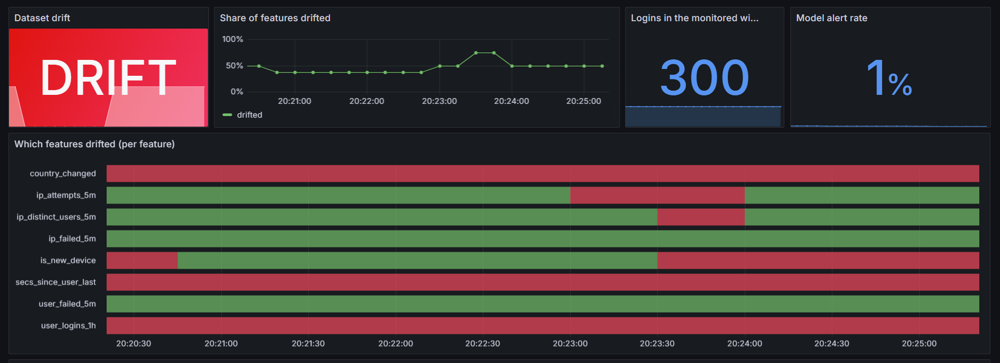

# Real-time Login Fraud Detection

A streaming feature store and model-serving platform that scores every login in milliseconds, using features that are fresh, point-in-time correct and monitored for drift.

**Stack:** Kafka · Spark Structured Streaming · Feast (Redis online store, Parquet offline store) · XGBoost · MLflow · FastAPI · Evidently · Prometheus · Grafana

## Architecture

```
generator -> Kafka -> Spark Structured Streaming --+--> Parquet      (offline store: history for training)
                                                   +--> Feast push -> Redis   (online store: latest state)

training:    Feast point-in-time join -> XGBoost -> MLflow registry (@champion alias)
serving:     FastAPI /score -> Redis -> signals.py -> champion model -> score
monitoring:  serving log -> Evidently -> Prometheus -> Grafana
```

## Key design decisions

- **No leakage, with a test that proves it.** Each login's features are looked up 1 µs *before* the login. `pytest` rebuilds 1,000 logins' features from only the raw events that came earlier and requires an exact match. Mutation-tested: a deliberately leaky training set fails 2 of 3 tests.
- **Leakage changes the numbers.** `python leakage_demo.py` trains the same model with three lookup strategies:
  `<paste the 3 output lines of leakage_demo.py here>`
- **One feature function for training and serving.** `signals.py` is shared, so the model never sees different logic in production.
- **No silently dropped training rows.** Feast's file offline store drops rows whose entity has no earlier history. The builder looks up each entity separately, left-merges, and asserts row counts.
- **Time-based split.** Train on the past, tune the alert threshold on a validation slice, report on the final slice.
- **Model registry.** MLflow tracks runs, parameters, metrics and the exact feature code. The API loads whichever model is `@champion`.
- **Drift monitoring.** Evidently compares the last 300 live logins with the training data. Prometheus and Grafana show which features drifted.

## Results

Synthetic data, time-based test split.

| Metric | Value |
|---|---|
| Train / test logins | 140,000 / 40,000 (1.6% fraud) |
| PR-AUC / ROC-AUC | 0.997 / 0.9999 |
| Precision / recall at chosen threshold | 0.93 / 0.99 |

The fraud patterns are synthetic and written by me, so these numbers show the pipeline works end to end, not that it would detect real fraud.



## Findings and limitations

- **Feature freshness vs attack tempo.** Spark and Feast publish each login to Redis 1–3 s after it happens. In one run, 6 attacker logins arrived about 0.1 s apart: the IP-burst counters stayed at 0, the model scored 0.19 against a 0.27 threshold, and all 6 were missed (offline recall was 99%). A real fix would compute short-window counters in the serving path.
- **Drift monitoring needs aligned clocks and rates.** An early drift reading flagged 4 of 8 features before any drift existed, because the backfill timeline did not line up with the live logins. Aligning the timelines and matching the live rate to the training rate fixed it.
- **Future-dated features fail silently.** A malformed `date -d '7 days 2 hours ago'` started the backfill a week in the *future*. Redis ignores writes older than the stored value, so every live login was dropped and `secs_since_user_last` came out at about −1.19M s for every request, flooding the model with false alarms. `check_future.py` now fails if any stored timestamp is later than the current time, and `preflight.sh` runs it.
- **Default drift tests are noisy** on small windows of count features. Treat drift alerts as an early warning, not proof the model broke. The alert rate stayed near 0.1% while inputs drifted.

## Run it

Requires Docker, Python 3.10 and Java 17 (Spark), plus two virtualenvs (Spark and Feast need different numpy versions).

```bash
docker compose up -d && make topics
python generator/generate.py --backfill 200000 --start "$(date -u -d '7 days ago' +%Y-%m-%dT%H:%M:%S)"

(cd feature_repo && feast apply && feast serve -p 6566)                                  # terminal 1
python spark/features_job.py --mode live --fresh --push-url http://localhost:6566/push   # terminal 2
python build_training_set.py && pytest -q && python train.py                             # once Redis is filled
uvicorn api:app --port 8000                                                              # terminal 3
python drift_job.py                                                                      # terminal 4
python generator/generate.py --drift-after 300 --score-url http://localhost:8000/score   # terminal 5
```

Grafana runs at <http://localhost:3000>.

**Health checks:** `./preflight.sh` (services and timestamp sanity) and `./check_monitoring.sh`.

**After a restart:** `bash services.sh start|status|stop|logs` runs Feast, Spark and the API in the background without needing separate terminals.
